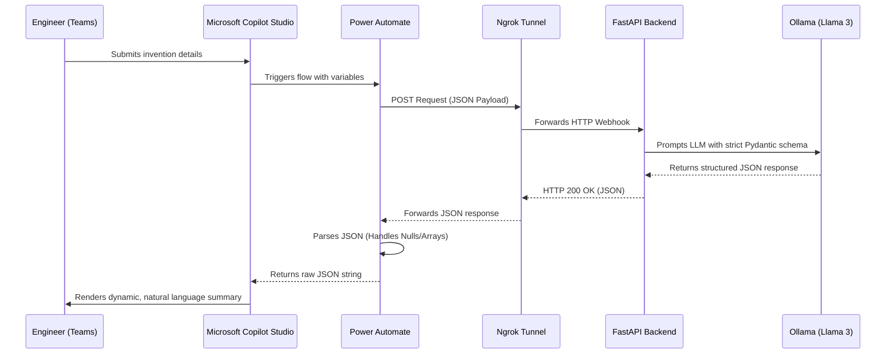

# AI Patent Disclosure Evaluator

An automated, agentic AI pipeline that evaluates engineering patent disclosures for technical clarity, novelty, and filing readiness. 

This project bridges local LLM inference (via Ollama) with Microsoft's cloud ecosystem (Copilot Studio & Power Automate), translating raw engineering ideas into structured, patent-ready documentation. It is designed to act as **infrastructure for innovation at scale**, fundamentally improving how engineers articulate inventions.

---

## Table of Contents
1. [Features](#-features)
2. [System Architecture](#-system-architecture)
3. [Prerequisites](#-prerequisites)
4. [Local Environment Setup (Backend)](#-local-environment-setup-backend)
5. [Microsoft Cloud Setup (Power Platform)](#-microsoft-cloud-setup-power-platform)
6. [API Documentation](#-api-documentation)
7. [Testing](#-testing)
8. [Troubleshooting](#-troubleshooting)

---

## Features

* **Agentic Conversational Interface:** Engineers interact with a natural language Copilot in Microsoft Teams to submit their ideas.
* **Deterministic AI Workflows:** Uses Pydantic to enforce strict JSON schemas on the LLM output, preventing hallucinations and ensuring data structure.
* **Middleware Orchestration:** Power Automate seamlessly routes payloads, handles webhooks, and manages JSON parsing between the cloud and local API.
* **Local, Private Inference:** Built on Ollama, ensuring sensitive IP data is processed locally and never sent to public LLM APIs like OpenAI.
* **Dynamic Rendering:** Bypasses rigid string manipulation by passing raw JSON directly back to Copilot, allowing the agent to dynamically format the final response.

---

## System Architecture



---

## Prerequisites
Python 3.10+

- Ollama installed and running locally.

- Ngrok (or similar tunneling service) to expose your local API to Power Automate.

- Microsoft Power Platform Account with Premium licensing (required for HTTP webhook actions).

- Microsoft Copilot Studio access.

- uv (or equivilant to use the pyproject.toml)

---

## Local Environment Setup (Backend)
1. Clone the repository:

```bash
git clone [https://github.com/EnderTheWigg/IP-Disclosure-CoPilot-Agent.git](https://github.com/EnderTheWigg/IP-Disclosure-CoPilot-Agent.git)
cd patent-evaluator
```
2. Set up a virtual environment:

```bash
python -m venv venv
source venv/bin/activate  # On Windows: venv\Scripts\activate
```
3. Install dependencies:

```bash
uv sync
```

4. Make sure Ollama is running, then download the model:

```bash
ollama pull llama3
```
5. Start the FastAPI server:

```bash
uvicorn app.main:app --host 0.0.0.0 --port 8000 --reload
Expose the API via Ngrok:
```
6. In a new terminal window, run:

```bash
ngrok http 8000
```
Note: Copy the https://<your-id>.ngrok.app URL. You will need this for Power Automate.

---

## Microsoft Cloud Setup (Power Platform)

To interact with the bot, you need to import the provided Power Platform solution into your Microsoft environment.

Navigate to make.powerapps.com.

Go to Solutions -> Import Solution.

Upload the AI_Patent_Evaluator_Solution.zip located in the /power_platform directory of this repo.

Once imported, open the Power Automate Flow included in the solution.

Edit the HTTP Action and replace the existing URL with your new Ngrok URL (e.g., https://<your-id>.ngrok.app/evaluate-disclosure).

Save and turn on the flow.

Open Copilot Studio, publish your bot, and test it in the Teams channel.

---

## API Documentation

POST /evaluate-disclosure
Evaluates the raw text of an invention disclosure against patentability metrics.

Request Payload:

```JSON
{
  "title": "Vertical Power MOSFET",
  "target_domain": "Power Semiconductors",
  "problem_statement": "High specific ON-resistance.",
  "technical_solution": "A vertical MOSFET structure with a series P+ anode...",
  "novel_features": "Integrating a series P+ anode carrier injection layer."
}
```
Response Payload:

```JSON
{
  "overall_patent_readiness_score": 85,
  "is_ready_for_filing": false,
  "clarity_critique": "The disclosure is well-structured but lacks specific voltage thresholds.",
  "missing_elements": [
    "Voltage ranges for the N-drift region",
    "Specific dimensions of the trench"
  ],
  "suggested_refinements": [
    "Define the exact doping concentration for the P+ anode."
  ],
  "novelty_flag": "Integrating the series P+ anode carrier injection layer is highly novel."
}
```

---

## Testing
This project uses pytest and unittest.mock to simulate LLM inference, ensuring the API and Pydantic schemas can be tested quickly without the overhead of running a local model.

Run the test suite:

```bash
pytest test_main.py -v
```

---

## Troubleshooting
Power Automate flow fails with "Null" error on join():
This happens if the JSON structure is misaligned. Ensure your Power Automate Parse JSON step is targeting body('Parse_JSON')?[0] if the payload root is an array.

FastAPI returns 422 Unprocessable Entity:
The payload sent from Power Automate does not match the Pydantic schema. Check the HTTP POST body in the Power Automate run history.

Timeout Errors in Power Automate:
Local LLM inference can take 10-30 seconds depending on your hardware. Power Automate HTTP actions time out after 2 minutes. Ensure you are using a suitably small model (like llama3 or phi3) for timely responses.
